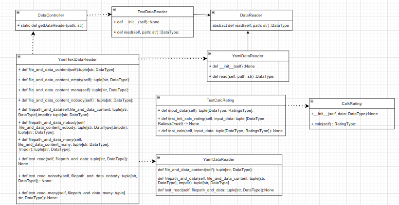

# Лабораторная 1 по дисциплине "Технологии программирования"
Цели работы:
1. Познакомиться c распределенной системой контроля версий кода Git и ее функциями;
2. Познакомиться с понятиями «непрерывная интеграция» (CI) и «непрерывное развертывание» 
(CD), определить их место в современной разработке программного обеспечения;
3. Получить навыки разработки ООП-программ и написания модульных тестов к ним на 
современных языках программирования;
4. Получить навыки работы с системой Git для хранения и управления версиями ПО;
5. Получить навыки управления автоматизированным тестированием программного обеспечения, 
расположенного в системе Git, с помощью инструмента GitHub Actions.

## Индивидуальный вариант - 9
Формат файла - YAML:

Определить и вывести на экран студента, имеющего 90
баллов по всем дисциплинам. Если таких студентов 
несколько, нужно вывести любого из них. Если таких 
студентов нет, необходимо вывести сообщение об их 
отсутствии.

Кастомная доработка:
Формат файла, передаваемого через аргумент командной строки -p определяется автоматически.
В случае, если это TXT - подключается стандартный обработчик, в случае YAML файла подключается обработчик индивидуального вариант

## Диаграмма классов

## Структура проекта
- .github/workflows - хранит github actions
- data - хранит в себе данные для обработки в форматах .txt и .yaml
- src/CalcRating.py - содержит класс с логикой расчёта
- src/DataController - содержит класс с выбором логики обработчика для файлов с данными
- src/DataReader - содержит базовый абстрактный класс для обработки данных из файлов
- src/TextDataReader - содержит класс для обработки данных из файлов формата .txt
- src/YamlDataReader - содержит класс для обработки данных из файлов формата .yaml
- src/test_CalcRating.py - содержит класс с логикой расчёта
- src/DataController - содержит класс с логикой выбора обработчика для файлов
- src/DataReader - содержит базовый абстрактный класс для обработки данных из файлов
- src/TextDataReader - содержит класс для обработки данных из файлов формата .txt
- src/YamlDataReader - содержит класс для обработки данных из файлов формата .yaml
- requirements.txt - файл с необходимыми библотеками для работы проекта

## Выводы по работе:
В этой лабораторной работе я познакомился с распределенной системой контроля версий кода Git и ее функциями, с понятиями «непрерывная интеграция» (CI) и «непрерывное развертывание», получил навыки написания модульных тестов и навыки управления автоматизированным тестированием программного обеспечения, 
расположенного в системе Git, с помощью инструмента GitHub Actions